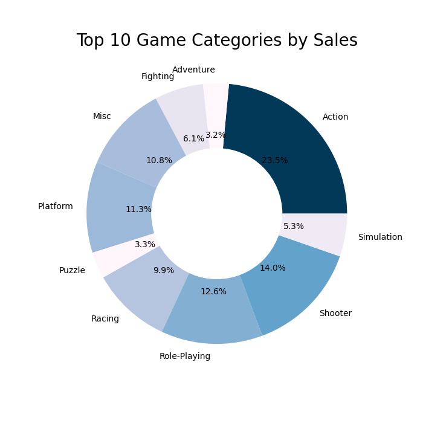
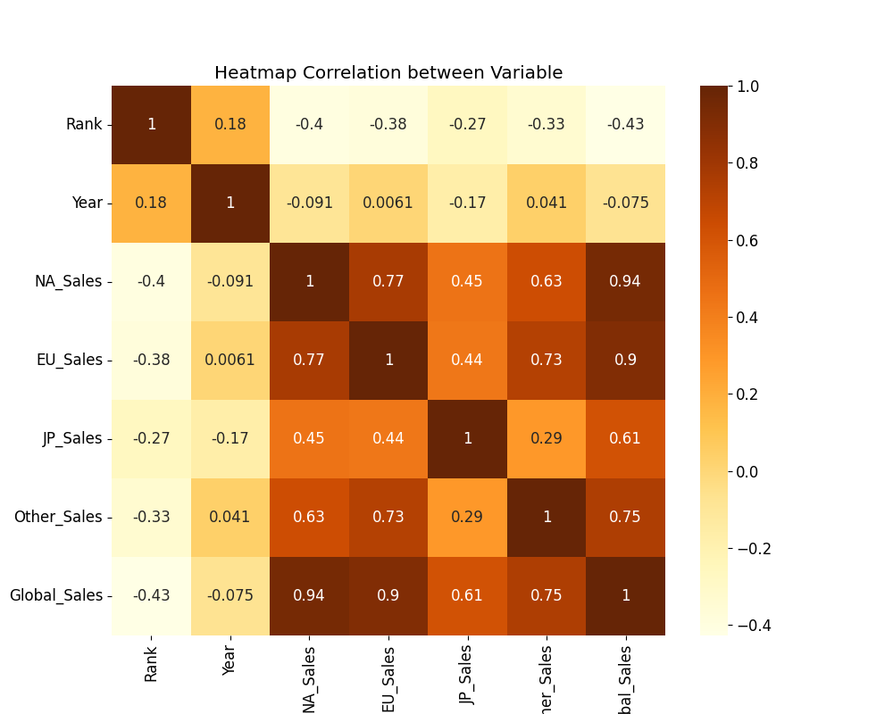

# Game Market Predictor

## About
Game Market Predictor is a Python-based project that analyzes video game sales data and applies machine learning to predict future sales. The project includes data preprocessing, sales analysis, correlation analysis, and predictive modeling using Linear Regression.

## Skills Demonstrated
### Core Python Concepts:
- **Object-Oriented Programming (OOP):**
  - **Encapsulation:** Data processing and analysis tasks are encapsulated into modular classes such as `DatasetProcessor`, `GenreSalesAnalyzer`, and `LinearRegressionTrainer`.
  - **Inheritance:** Specialized processors inherit from `DatasetProcessor`, allowing for reuse and extensibility.
  - **Abstraction:** Logical grouping of operations provides a clean and user-friendly interface.
- **Modular Design:** Organized with separate classes for dataset processing, sales analysis, correlation analysis, and model training.
- **Data Handling:** Efficiently loads, processes, and cleans datasets.
- **Visualization:** Generates pie charts and heatmaps for sales and correlation analysis.
- **Machine Learning:** Implements Linear Regression to predict video game sales based on regional data.

## Example Output
### Genre Sales Analyzer
A pie chart visualizing the top 10 game genres by global sales.



### Heatmap Correlation Analyzer
A heatmap displaying correlations between different numerical features in the dataset.



### Linear Regression Trainer
A trained Linear Regression model saved in the `models/` directory with the following performance metrics:
```
Mean Absolute Error: 0.0031061418784741287
Mean Squared Error: 2.853954078949892e-05
R-squared: 0.9999933287153024
```

## About Me
**A. RAHMAN** - Data Scientist & Python Developer

